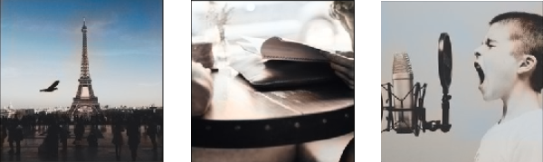

# greyscale-color-images
Coloring greyscale images with deep learning.

For more details on this, Kindly check the paper -   

I tried to implement the same architecture as present in the paper, however, due to GPU and RAM limitation, I was unable to complete it. I removed the fusion of inception network and trained on nearly 5000 images. Which gave average results but not satisfactory. 
 
<b>Key takeaways</b> -  
<ul>The network is very bad in generalizing at a lower number of epochs with a varied dataset, maybe I have to try with a larger dataset and more number of epochs.</ul> <ul>I suggest going with a domain-specific dataset, for example, coloring images of nature, train the model with a similar dataset.</ul>

Examples -  

Image dataset was downloaded from google images, refer to link (https://www.pyimagesearch.com/2017/12/04/how-to-create-a-deep-learning-dataset-using-google-images/)
